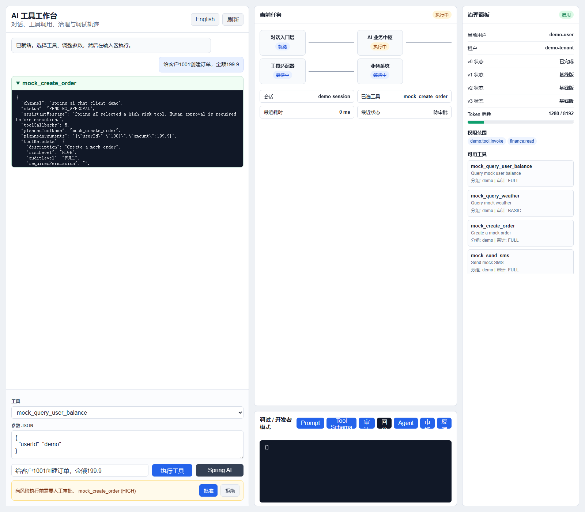
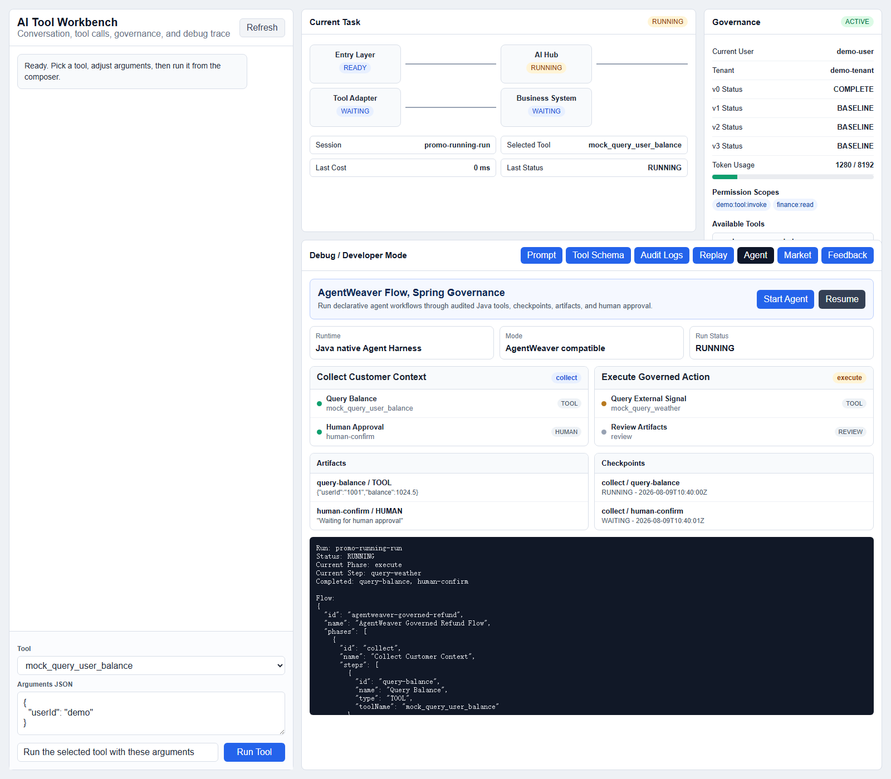
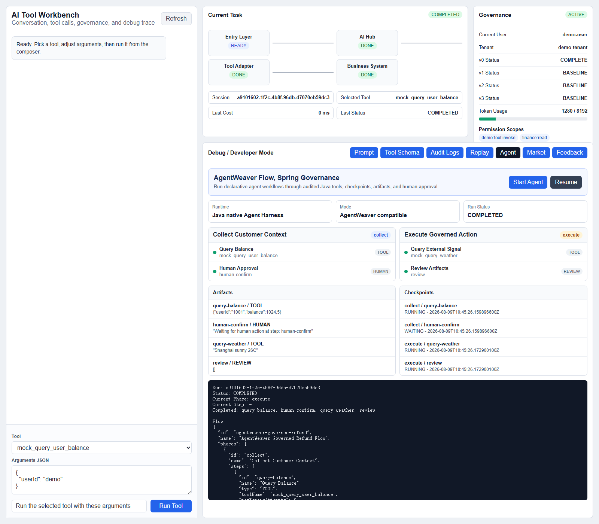
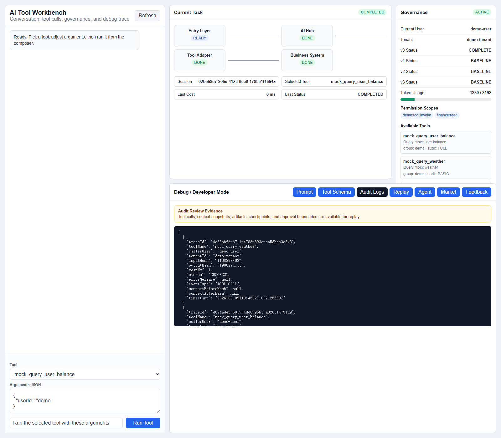
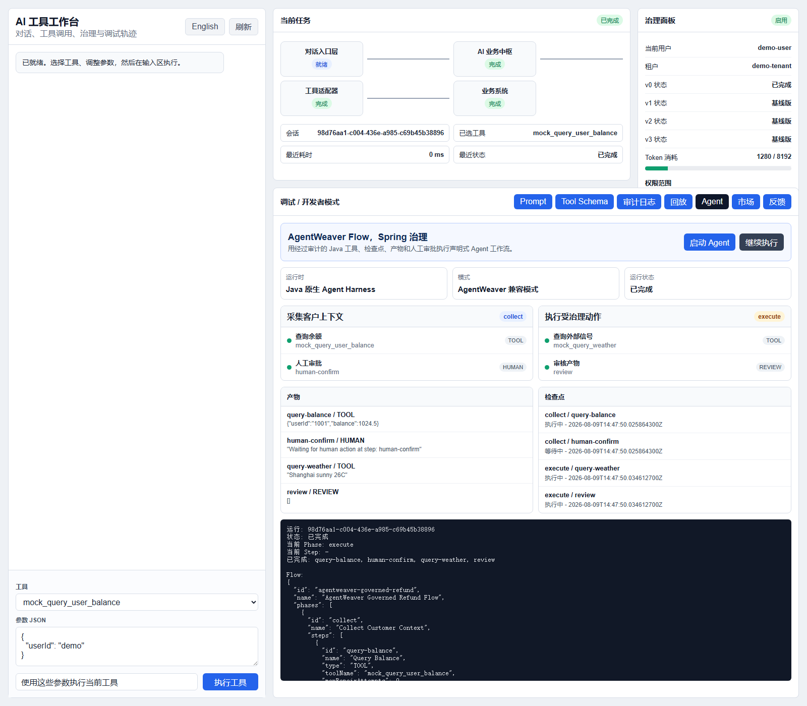

# Spring AI Tool Adapter

Enterprise-oriented Java adapter that exposes annotated Spring Bean methods as AI-callable tools.

We don't just expose methods to LLMs. We annotate business intent, risk, and trust boundaries.

## Quick Start

1. Build: `mvn test`
2. Run: `mvn -pl adapter-demo spring-boot:run`
3. Open: `http://localhost:8080/chat`

## Spring Boot Starter

Use the starter in existing Spring Boot applications:

```xml
<dependency>
    <groupId>com.c8software.spring.ai</groupId>
    <artifactId>spring-ai-tool-adapter-starter</artifactId>
    <version>0.1.0</version>
</dependency>
```

The starter auto-registers `AiToolAutoConfiguration` for Spring Boot 2 and Spring Boot 3.

One-minute runnable starter sample:

```bash
mvn -pl examples/starter-minimal spring-boot:run
```

Then open:

- `http://localhost:8081/tools`
- `http://localhost:8081/tools/openai-schema`

See [One-Minute Starter Quickstart](docs/en/one-minute-starter.md) and [一分钟 Starter 接入](docs/zh/one-minute-starter.md).

## Example Tools

- `mock_query_user_balance`
- `mock_send_sms`
- `mock_create_order`
- `mock_query_weather`
- `mock_query_complaint_customer`

## Governance Contract

Tool annotations describe what can be called. Governance annotations describe who may call it, how risky it is, how it is audited, which parameters are sensitive, whether calls are idempotent, whether an action is reversible, and how results bind into conversation context.

## Enterprise P0 Governance

- Persistent audit logging through `JdbcAuditLogger` when a `DataSource` is available.
- Human-in-the-loop approval gate for `HIGH` and `CRITICAL` risk tools.
- Idempotency protection for tools annotated with `@AiToolIdempotent`.
- Visibility filtering so `INTERNAL` and `DEPRECATED` tools do not pollute LLM schemas.
- Timeout-isolated tool invocation through `ToolInvocationExecutor`.
- Return-value masking through method-level `@AiToolSensitive`.
- Maven publishing metadata for GitHub Packages.

## Maven Publishing

The root POM includes GitHub Packages distribution management. Configure a Maven server named `github` in `~/.m2/settings.xml`, then run:

```bash
mvn -DskipTests deploy
```

## Semantic MCP Skills

The adapter can turn natural-language integration needs into an MCP provisioning plan. The default implementation matches semantic capability tags and returns risk, permission, and approval status. It does not directly install external MCP servers; enterprise implementations can replace the catalog and matcher through SPI.

## Spring AI Integration

Use `spring-ai-tool-adapter-spring-ai` when an application already uses Spring AI `ChatClient` or Spring AI Tool Calling. It exposes governed adapter tools as Spring AI `ToolCallbackProvider` callbacks while keeping permission checks, audit, timeout isolation, masking, Session + Context, and tool metadata inside this adapter. The bridge also provides ToolContext mapping and a ChatMemoryRepository aligned with adapter session ids.

The demo also includes a Spring AI ChatClient-style flow with human approval:

- Direct low-risk call: `POST /api/spring-ai/chat`
- Pending approvals: `GET /api/approvals`
- Approve and execute: `POST /api/approvals/{approvalId}/approve`
- Reject: `POST /api/approvals/{approvalId}/reject`
- UI shortcut: `/chat?lang=zh&springai=approval-auto`



## Agent Harness

Use `adapter-agent-harness` for Java-native v2 workflows with phases, steps, checkpoints, artifacts, review gates, repair loops, and human waiting nodes. It can invoke governed tools through `ToolAgentStepExecutor` and keeps AgentWeaver-style harness ideas as Java contracts.

Demo UI supports both English and Chinese:

- English: `/chat?promo=agentweaver&state=completed`
- Chinese: `/chat?lang=zh&promo=agentweaver&state=completed`


### Demo State Gallery

| Running | Waiting / Resume |
| --- | --- |
|  |  |

| Completed | Audit Review |
| --- | --- |
|  |  |

| Chinese Completed |
| --- |
|  |

## Codex Skill for Existing Systems

This repository includes `skills/spring-ai-adapt-existing-system`, a reusable Codex skill for teams adopting the framework in an existing Spring application. It guides Codex to scan current services, generate governed `@AiTool` facades, bind session context, add semantic MCP provisioning plans, and create tests.

## Product Direction

- v0.x: Tool Adapter covering tool registration, schema, execution, audit, and Chat UI.
- v1.x: Business AI hub covering multi-turn dialogue, tool groups, permissions, approval, and replay.
- v2.x: Tasks and agents covering workflow orchestration, multi-agent collaboration, long tasks, and human nodes.
- v3.x: Enterprise AI operating system covering self-learning, prompt marketplace, tool marketplace, private deployment, and multi-tenancy.

## Documents

- [Chinese User Guide](docs/zh/user-guide.md)
- [一分钟 Starter 接入](docs/zh/one-minute-starter.md)
- [Chinese Java Usage](docs/zh/java-usage.md)
- [Chinese Feature Reference](docs/zh/feature-reference.md)
- [English User Guide](docs/en/user-guide.md)
- [One-Minute Starter Quickstart](docs/en/one-minute-starter.md)
- [English Feature Reference](docs/en/feature-reference.md)
- [Chinese Spring AI Integration](docs/zh/spring-ai-integration.md)
- [English Spring AI Integration](docs/en/spring-ai-integration.md)
- [Chinese Agent Harness](docs/zh/agent-harness.md)
- [English Agent Harness](docs/en/agent-harness.md)
- [Architecture](architecture.md)
- [Functional Plan](functional-plan.md)
- [Roadmap](roadmap.md)
- [v0 Completion](v0-completion.md)
- [v1 Baseline](v1-completion.md)
- [v3 Baseline](v3-completion.md)
- [World Model](world-model.yaml)
- [Capability Boundaries](capability-boundaries.yaml)
- [Phase Prompts](phase-prompts.yaml)
