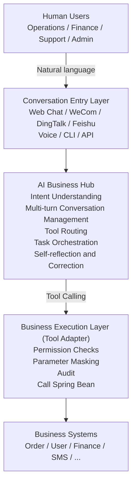

# Architecture

This project is positioned as the v0.x Tool Adapter inside a larger enterprise AI product architecture.

## Current v0.x Scope

`adapter-core` implements the business execution layer:

- `@AiTool`, `@Sensitive`, and `@ToolGroup` annotations.
- `AiToolRegistrar` for Spring Bean method discovery and registration.
- `ToolRegistry` for thread-safe tool lookup.
- Schema converters for OpenAI-compatible providers and local models.
- `DefaultToolExecutor` for JSON argument binding, permission checks, masking, audit, and Spring Bean invocation.
- SPI contracts for permission, masking, audit, conversation, approval, and task orchestration.

`adapter-demo` provides a working shell around the adapter:

- Chat workbench UI.
- Tool-call cards and task visualization.
- Governance panel for user, tenant, permission scopes, and token usage.
- Developer debug tabs for Prompt, Tool Schema, and audit logs.

## Context Principle

Tool registration answers "what can the system do".

Session and Context answer "what is the system doing now, which step is active, and what did the user already choose".

Context is not chat history. It is structured business state:

- Session state identifies user, tenant, role, permission snapshot, and model.
- Task state records task type, status, current step, and pending approvals.
- Choice state records confirmed user selections and overrides.

Every confirmed choice becomes an immutable fact. Every context mutation that matters to execution must be auditable.

## Evolution Path

- v1.x adds the AI Business Hub: multi-turn state, tool groups, permissions, approvals, and replay.
- v2.x adds Tasks and Agents: workflows, multi-agent collaboration, long tasks, and human nodes.
- v3.x becomes an Enterprise AI Operating System: self-learning, Prompt marketplace, Tool marketplace, private deployment, and multi-tenant operations.
