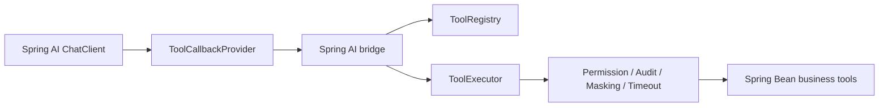

# Spring AI Integration

The Spring AI integration lives in the optional `spring-ai-tool-adapter-spring-ai` module.

Spring AI exposes tools through `ToolCallback` and `ToolCallbackProvider`. This project keeps tool discovery, schema generation, permission metadata, timeout isolation, masking, audit, and Session + Context in the adapter layer. The bridge module adapts governed tools into Spring AI callbacks.

## Maven Dependencies

```xml
<dependency>
    <groupId>com.c8software.spring.ai</groupId>
    <artifactId>spring-ai-tool-adapter-starter</artifactId>
    <version>0.1.0</version>
</dependency>
<dependency>
    <groupId>com.c8software.spring.ai</groupId>
    <artifactId>spring-ai-tool-adapter-spring-ai</artifactId>
    <version>0.1.0</version>
</dependency>
```

## Bean Setup

The module auto-registers a `ToolCallbackProvider`. Override `SpringAiExecutionContextFactory` when the application needs custom user, tenant, trace, or permission mapping:

```java
@Bean
SpringAiExecutionContextFactory springAiExecutionContextFactory() {
    return toolContext -> {
        // map enterprise user, tenant, trace, and permissions here
        return new ExecutionContext("u1001", "tenant-a", "trace-001",
                Collections.singleton("order:refund"), Instant.now());
    };
}
```

Then pass the callbacks to Spring AI:

```java
ToolCallback[] callbacks = governedToolCallbackProvider.getToolCallbacks();
```

Business tools remain declared with the adapter annotations:

```java
@AiTool(name = "refund_order", description = "Create refund request")
@AiToolRequiresPermission("order:refund")
@AiToolRiskLevel(RiskLevel.HIGH)
@AiToolAudit(AuditLevel.FULL)
public RefundResult refundOrder(Long orderId, BigDecimal amount) {
    return refundService.refund(orderId, amount);
}
```

## Context Mapping

When Spring AI passes a `ToolContext`, the bridge maps these keys into the adapter `ExecutionContext`:

| Key | Meaning |
| --- | --- |
| `currentUser` | Current user |
| `tenantId` | Tenant id |
| `traceId` | Trace id |
| `permissions` | Permission collection or comma-separated string |

Implement `SpringAiExecutionContextFactory` to plug in an enterprise user, tenant, or permission model.

## Recommended Architecture



Spring AI should continue to handle model calls, Advisors, RAG, and ChatClient orchestration. This project owns enterprise-grade Tool Adapter governance.
