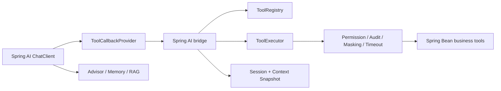

# Spring AI Integration

The Spring AI integration lives in the optional `spring-ai-tool-adapter-spring-ai` module.

Spring AI exposes tools through `ToolCallback` and `ToolCallbackProvider`. This project keeps tool discovery, schema generation, permission metadata, timeout isolation, masking, audit, and Session + Context in the adapter layer. The bridge module adapts governed tools into Spring AI callbacks.

## Maven Dependencies

```xml
<dependency>
    <groupId>com.c8software.spring.ai</groupId>
    <artifactId>spring-ai-tool-adapter-starter</artifactId>
    <version>0.1.0</version>
</dependency>
<dependency>
    <groupId>com.c8software.spring.ai</groupId>
    <artifactId>spring-ai-tool-adapter-spring-ai</artifactId>
    <version>0.1.0</version>
</dependency>
```

## Bean Setup

The module auto-registers:

- `ToolCallbackProvider`
- `SpringAiExecutionContextFactory`
- `SpringAiToolContextAdapter`
- `ChatMemoryRepository`

Override `SpringAiExecutionContextFactory` when the application needs custom user, tenant, trace, or permission mapping:

```java
@Bean
SpringAiExecutionContextFactory springAiExecutionContextFactory() {
    return toolContext -> {
        // map enterprise user, tenant, trace, and permissions here
        return new ExecutionContext("u1001", "tenant-a", "trace-001",
                Collections.singleton("order:refund"), Instant.now());
    };
}
```

Then pass the callbacks to Spring AI:

```java
ToolCallback[] callbacks = governedToolCallbackProvider.getToolCallbacks();
```

## ChatClient Usage

Use the bridge from an application running Spring Boot 3 and Spring AI:

```java
@Service
public class AiAssistant {
    private final ChatClient chatClient;
    private final ToolCallbackProvider governedTools;

    public AiAssistant(ChatClient.Builder builder, ToolCallbackProvider governedTools) {
        this.chatClient = builder
                .defaultToolCallbacks(governedTools)
                .build();
        this.governedTools = governedTools;
    }

    public String chat(String input) {
        return chatClient.prompt()
                .user(input)
                .call()
                .content();
    }
}
```

Spring AI owns model calls and the tool-calling lifecycle. This project keeps authorization, audit, masking, timeout isolation, idempotency, and approval inside `ToolExecutor`.

Business tools remain declared with the adapter annotations:

```java
@AiTool(name = "refund_order", description = "Create refund request")
@AiToolRequiresPermission("order:refund")
@AiToolRiskLevel(RiskLevel.HIGH)
@AiToolAudit(AuditLevel.FULL)
public RefundResult refundOrder(Long orderId, BigDecimal amount) {
    return refundService.refund(orderId, amount);
}
```

## Demo Approval Loop

`adapter-demo` exposes a runnable ChatClient-style demo that uses the real `ToolCallbackProvider` bridge. The planner is deterministic so the demo works without an LLM API key, but tool execution still goes through Spring AI `ToolCallback` and then the governed adapter `ToolExecutor`.

- `POST /api/spring-ai/chat`: plan from natural language and execute low-risk tools.
- `GET /api/approvals`: list pending high-risk calls.
- `POST /api/approvals/{approvalId}/approve`: approve and execute the stored call.
- `POST /api/approvals/{approvalId}/reject`: reject the stored call.
- `/chat?lang=zh&springai=approval-auto`: open the UI and automatically stop at the approval gate.


Example high-risk request:

```json
{"message":"Create an order for customer 1001 with amount 199.9"}
```

## Context Mapping

When Spring AI passes a `ToolContext`, the bridge maps these keys into the adapter `ExecutionContext`:

| Key | Meaning |
| --- | --- |
| `currentUser` | Current user |
| `tenantId` | Tenant id |
| `traceId` | Trace id |
| `permissions` | Permission collection or comma-separated string |

Implement `SpringAiExecutionContextFactory` to plug in an enterprise user, tenant, or permission model.

## Memory And Context

The bridge provides a default `ChatMemoryRepository`. Use the adapter `sessionId` as the Spring AI conversationId so Spring AI message memory and adapter Session + Context share the same boundary.

`SpringAiToolContextAdapter` maps the current thread-bound `ContextSnapshot` into Spring AI `ToolContext`. Recommended rules:

- Spring AI Memory stores dialogue messages only.
- Adapter Context stores structured business facts.
- Confirmed user choices must be written into Context facts.
- ToolContext is a runtime carrier, not the source of truth.

## Advisor Placement

Advisors belong in the Spring AI application layer for prompt enrichment, RAG injection, memory assembly, and observation. Enterprise governance should stay in adapter `ToolExecutor` and SPI implementations.

## Recommended Architecture



Spring AI should continue to handle model calls, Advisors, RAG, and ChatClient orchestration. This project owns enterprise-grade Tool Adapter governance.
