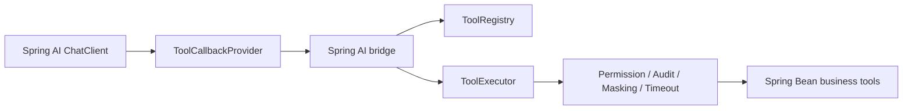

# Spring AI 集成说明

本项目和 Spring AI 的结合点放在独立模块 `spring-ai-tool-adapter-spring-ai` 中。

Spring AI 官方 Tool Calling 的核心抽象是 `ToolCallback`，并通过 `ToolCallbackProvider` 向 `ChatClient` 或工具调用生命周期提供工具。本项目负责工具注册、Schema、权限、超时隔离、脱敏、审计、Session + Context；桥接模块负责把这些治理后的工具暴露成 Spring AI 可调用的工具。

## Maven 依赖

```xml
<dependency>
    <groupId>com.c8software.spring.ai</groupId>
    <artifactId>spring-ai-tool-adapter-starter</artifactId>
    <version>0.1.0</version>
</dependency>
<dependency>
    <groupId>com.c8software.spring.ai</groupId>
    <artifactId>spring-ai-tool-adapter-spring-ai</artifactId>
    <version>0.1.0</version>
</dependency>
```

## Spring Bean 配置

引入模块后会自动注册 `ToolCallbackProvider`。如果需要替换上下文映射，可以自定义 `SpringAiExecutionContextFactory`：

```java
@Bean
SpringAiExecutionContextFactory springAiExecutionContextFactory() {
    return toolContext -> {
        // map enterprise user, tenant, trace, and permissions here
        return new ExecutionContext("u1001", "tenant-a", "trace-001",
                Collections.singleton("order:refund"), Instant.now());
    };
}
```

然后在 Spring AI `ChatClient` 中使用该 provider 暴露的 callbacks：

```java
ToolCallback[] callbacks = governedToolCallbackProvider.getToolCallbacks();
```

业务工具仍然只需要使用本项目注解声明：

```java
@AiTool(name = "refund_order", description = "Create refund request")
@AiToolRequiresPermission("order:refund")
@AiToolRiskLevel(RiskLevel.HIGH)
@AiToolAudit(AuditLevel.FULL)
public RefundResult refundOrder(Long orderId, BigDecimal amount) {
    return refundService.refund(orderId, amount);
}
```

## 上下文映射

Spring AI 调用工具时可以传入 `ToolContext`。桥接模块会读取以下 key 并转换为本项目的 `ExecutionContext`：

| Key | 含义 |
| --- | --- |
| `currentUser` | 当前用户 |
| `tenantId` | 租户 |
| `traceId` | 追踪 ID |
| `permissions` | 权限集合或逗号分隔字符串 |

如果企业系统有自己的用户、租户、数据权限模型，可以实现 `SpringAiExecutionContextFactory`，把 Spring AI 上下文转换成自己的治理上下文。

## 推荐架构



这个结合方式的重点是：Spring AI 继续负责模型调用、Advisor、RAG 和 ChatClient 编排；本项目负责企业级 Tool Adapter 治理。
