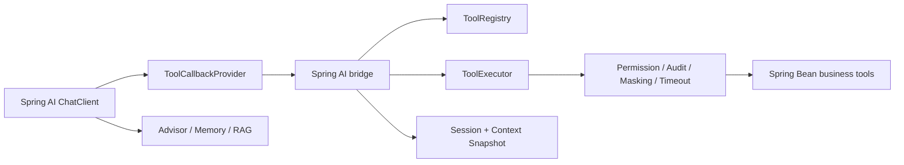

# Spring AI 集成说明

本项目和 Spring AI 的结合点放在独立模块 `spring-ai-tool-adapter-spring-ai` 中。

Spring AI 官方 Tool Calling 的核心抽象是 `ToolCallback`，并通过 `ToolCallbackProvider` 向 `ChatClient` 或工具调用生命周期提供工具。本项目负责工具注册、Schema、权限、超时隔离、脱敏、审计、Session + Context；桥接模块负责把这些治理后的工具暴露成 Spring AI 可调用的工具。

## Maven 依赖

```xml
<dependency>
    <groupId>com.c8software.spring.ai</groupId>
    <artifactId>spring-ai-tool-adapter-starter</artifactId>
    <version>0.1.0</version>
</dependency>
<dependency>
    <groupId>com.c8software.spring.ai</groupId>
    <artifactId>spring-ai-tool-adapter-spring-ai</artifactId>
    <version>0.1.0</version>
</dependency>
```

## Spring Bean 配置

引入模块后会自动注册：

- `ToolCallbackProvider`
- `SpringAiExecutionContextFactory`
- `SpringAiToolContextAdapter`
- `ChatMemoryRepository`

如果需要替换上下文映射，可以自定义 `SpringAiExecutionContextFactory`：

```java
@Bean
SpringAiExecutionContextFactory springAiExecutionContextFactory() {
    return toolContext -> {
        // map enterprise user, tenant, trace, and permissions here
        return new ExecutionContext("u1001", "tenant-a", "trace-001",
                Collections.singleton("order:refund"), Instant.now());
    };
}
```

然后在 Spring AI `ChatClient` 中使用该 provider 暴露的 callbacks：

```java
ToolCallback[] callbacks = governedToolCallbackProvider.getToolCallbacks();
```

## ChatClient 接入

推荐在业务自己的 Spring Boot 3 + Spring AI 应用里接入：

```java
@Service
public class AiAssistant {
    private final ChatClient chatClient;
    private final ToolCallbackProvider governedTools;

    public AiAssistant(ChatClient.Builder builder, ToolCallbackProvider governedTools) {
        this.chatClient = builder
                .defaultToolCallbacks(governedTools)
                .build();
        this.governedTools = governedTools;
    }

    public String chat(String input) {
        return chatClient.prompt()
                .user(input)
                .call()
                .content();
    }
}
```

Spring AI 负责模型调用和工具调用生命周期；本项目的 `ToolExecutor` 负责权限、审计、脱敏、超时隔离、幂等和审批。

业务工具仍然只需要使用本项目注解声明：

```java
@AiTool(name = "refund_order", description = "Create refund request")
@AiToolRequiresPermission("order:refund")
@AiToolRiskLevel(RiskLevel.HIGH)
@AiToolAudit(AuditLevel.FULL)
public RefundResult refundOrder(Long orderId, BigDecimal amount) {
    return refundService.refund(orderId, amount);
}
```

## 上下文映射

Spring AI 调用工具时可以传入 `ToolContext`。桥接模块会读取以下 key 并转换为本项目的 `ExecutionContext`：

| Key | 含义 |
| --- | --- |
| `currentUser` | 当前用户 |
| `tenantId` | 租户 |
| `traceId` | 追踪 ID |
| `permissions` | 权限集合或逗号分隔字符串 |

如果企业系统有自己的用户、租户、数据权限模型，可以实现 `SpringAiExecutionContextFactory`，把 Spring AI 上下文转换成自己的治理上下文。

## Memory 与 Context

桥接模块提供默认 `ChatMemoryRepository`，conversationId 建议直接使用本项目的 `sessionId`。这样 Spring AI 的消息记忆和本项目的 Session + Context 可以共享同一个会话边界。

`SpringAiToolContextAdapter` 可以把当前线程绑定的 `ContextSnapshot` 转换成 Spring AI `ToolContext`。推荐规则：

- Spring AI Memory 只保存对话消息。
- 本项目 Context 保存结构化业务事实。
- 已确认选择必须进入 Context facts。
- ToolContext 只作为执行时传递层，不作为最终事实来源。

## Advisor 放置位置

Advisor 推荐放在 Spring AI 应用层，用来做 Prompt 增强、RAG 注入、Memory 拼装和观测。企业治理逻辑不要写进 Advisor，而应该继续留在本项目的 `ToolExecutor` 和 SPI 中。

## 推荐架构



这个结合方式的重点是：Spring AI 继续负责模型调用、Advisor、RAG 和 ChatClient 编排；本项目负责企业级 Tool Adapter 治理。
