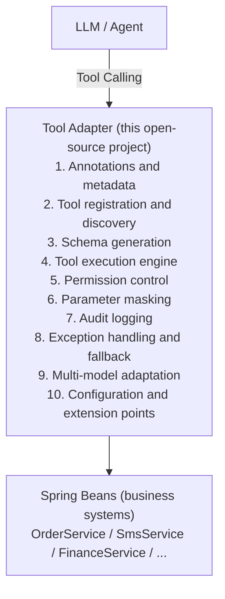

# Functional Plan

## Overall Layers



## 1. Annotations And Metadata

MVP:

- `@AiTool` marks a method as AI-callable.
- `name` is globally unique.
- `description` describes business intent.
- `paramDescriptions` documents parameters.
- `enabled` supports static and externalized switches.
- `requiresPermission` declares the permission scope.
- `auditLevel` uses `AuditLevel.NONE`, `AuditLevel.BASIC`, or `AuditLevel.FULL`.

Example:

```java
@AiTool(
    name = "query_user_balance",
    description = "Query user account balance",
    paramDescriptions = {"userId=user id", "currency=currency, default CNY"},
    requiresPermission = "finance:read",
    auditLevel = AuditLevel.FULL
)
public BigDecimal getBalance(Long userId, String currency) {
    return BigDecimal.ZERO;
}
```

## 2. Tool Registration And Discovery

MVP:

- Scan Spring Beans at startup with `BeanPostProcessor`.
- Discover `@AiTool` methods.
- Cache immutable `ToolMetadata` and method handles.
- Validate globally unique tool names.
- Support externalized enable/disable switches through `ai.tool.tools.<toolName>`.

Future:

- Dynamic refresh from Nacos or Apollo.

## 3. Tool Schema Generation

MVP:

- OpenAI Function Calling JSON Schema.
- Azure OpenAI, DeepSeek, Tongyi Qwen, Doubao, and Ollama converters.
- Java type mapping for string, integer, number, boolean, enum, and simple arrays.
- Enum export as string lists.
- Validation export for `@NotNull`, `@Min`, and `@Max` when present.

## 4. Tool Execution Engine

MVP:

- Deserialize JSON arguments to Java values.
- Convert primitive wrapper types and enums through Jackson.
- Invoke target methods through cached `MethodHandle`.
- Wrap failures with `AiToolExecutionException`.
- Write audit records after execution.

Execution flow:

```text
LLM JSON -> parameter binding -> permission check -> masking -> business method
         -> result serialization -> audit -> response to LLM
```

Future:

- `CompletableFuture` async tool support.
- Explicit timeout runner around slow tools.

## 5. Permission Control

MVP:

- `PermissionChecker` SPI.
- Default permission matching through `ExecutionContext.permissions`.
- `requiresPermission` on `@AiTool`.

Future:

- Spring Security RBAC integration.
- SpEL permission expressions.
- Department and tenant data scopes.
- Configurable reject strategy.

## 6. Parameter Masking

MVP:

- `@Sensitive(type = ...)` on parameters.
- Built-in mobile, ID card, bank card, name, and custom masking categories.
- Audit input uses masked values instead of raw sensitive values.

Future:

- Return-value masking before sending data back to LLM.

## 7. Audit Logging

Audit fields:

- `trace_id`
- `tool_name`
- `caller_user`
- `tenant_id`
- `input_hash`
- `output_hash`
- `cost_ms`
- `status`
- `error_msg`

MVP storage:

- Async in-memory audit logger for demo and tests.

Future storage:

- MySQL / PostgreSQL default storage.
- Optional Elasticsearch / ClickHouse storage.

## 8. Exception Handling And Fallback

MVP:

- `AiToolException` base class with `errorCode`.
- `AiToolRegistrationException`.
- `AiToolExecutionException`.
- `AiToolSecurityException`.
- Configurable fallback response:

```yaml
ai:
  tool:
    fallback:
      enabled: true
      message: "该工具暂时不可用，请稍后重试"
```

Future:

- Idempotent retry strategy.
- Resilience4j circuit breaker.

## 9. Multi-model Adaptation

Supported schema converters:

- OpenAI
- Azure OpenAI
- DeepSeek
- Tongyi Qwen
- Doubao
- Ollama
- Local OpenAI-compatible models

SPI:

```java
public interface ToolSchemaConverter {
    Map<String, Object> convert(ToolDefinition definition);
    String provider();
}
```

## 10. Configuration And Extension Points

Extension points:

- `ToolRegistry` for custom tool sources.
- `ToolExecutor` for custom execution behavior.
- `AuditLogger` for custom audit storage.
- `PermissionChecker` for internal authorization systems.
- `SensitiveMasker` for custom masking rules.
- `ToolSchemaConverter` for model-specific schema formats.

Auto-configuration:

- `AiToolAutoConfiguration` provides default beans.
- All default beans use `@ConditionalOnMissingBean`.
- `AiToolProperties` exposes `ai.tool.*` configuration.

## 11. Conversation Session And Context

Context is a business state machine, not a chat log.

MVP:

- `ConversationSession` is transport-neutral and not coupled to raw HTTP Session.
- `TaskContext` tracks task id, type, status, current step, and pending approval.
- `UserChoiceTracker` persists confirmed user choices as immutable facts.
- `ContextCompressor` preserves confirmed choices and compresses only safe state.
- `ContextSnapshot` allows audit replay before and after tool execution.

Required state:

- Session: `sessionId`, `tenantId`, `userId`, `role`, `authScope`, `modelProvider`, `modelName`.
- Task: `taskId`, `taskType`, `taskStatus`, `currentStep`, `pendingApproval`.
- Choice: `selectedCustomerId`, `selectedTemplateId`, `selectedAmount`, `confirmedByUser`, `userOverrides`.

Hard constraints:

- No raw HTTP Session coupling in `adapter-core`.
- No UI state management in `adapter-core`.
- No conversational memory without audit.
- Tool execution failure must not erase context.
- Compression must not lose confirmed facts or user intent.

Audit scope:

- Context snapshots before and after tool execution.
- User choice confirmation events.
- Context compression events.
- Session reset events.
