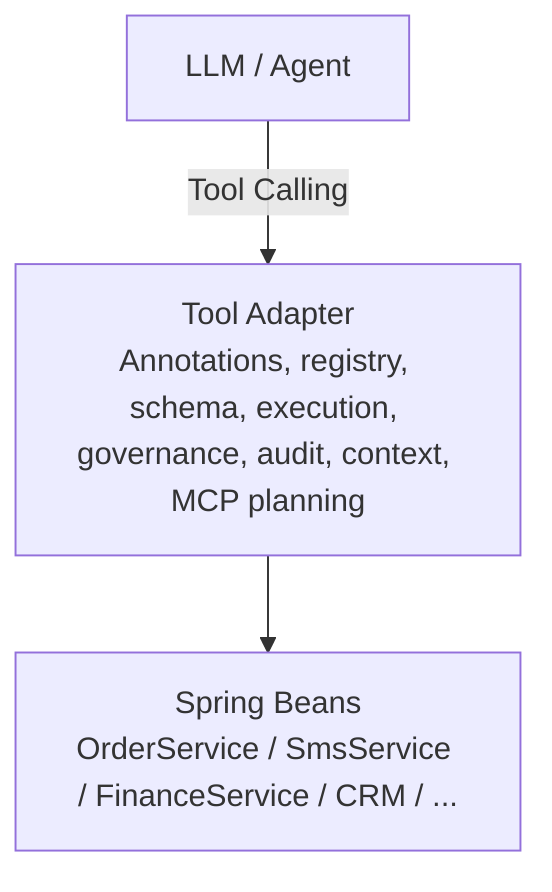

# Functional Plan

## Overall Layers



The project exposes Spring business capabilities to LLMs through a governed adapter layer. The adapter owns framework contracts and default SPIs. Business services remain in the adopter's application.

## 1. Annotation And Governance Metadata

MVP:

- `@AiTool` marks a method as AI-callable.
- `@AiToolRequiresPermission` declares required permission.
- `@AiToolRiskLevel` declares risk level.
- `@AiToolAudit` declares audit level.
- `@AiToolParam` describes parameter semantics.
- `@AiToolSensitive` marks sensitive parameters.
- `@AiToolIdempotent` declares an idempotency key.
- `@AiToolRollback` declares a compensating method.
- `@AiToolVisibility` controls tool visibility.
- `@AiToolVersion` declares contract version.
- `@AiToolContextKey` binds parameters or results into structured conversation context.

Design rules:

- Governance annotations are declarative.
- Annotation processors do not contain business policy logic.
- Parsed metadata is stored in immutable `ToolMetadata` and `ToolParameter`.
- New governance annotations override legacy fields on `@AiTool`, while legacy fields remain compatible.

## 2. Tool Registration And Discovery

MVP:

- Scan Spring Beans at startup with `BeanPostProcessor`.
- Discover `@AiTool` methods.
- Parse governance annotations through `ToolGovernanceAnnotationProcessor`.
- Cache immutable metadata and `MethodHandle`.
- Validate globally unique tool names.
- Support externalized enable/disable switches through `ai.tool.tools.<toolName>`.

Important classes:

- `AiToolRegistrar`
- `ToolRegistry`
- `ReflectionToolDefinition`
- `DefaultToolGovernanceAnnotationProcessor`

Future:

- Dynamic refresh from Nacos or Apollo.
- External tool catalogs.

## 3. Tool Schema Generation

MVP:

- OpenAI Function Calling JSON Schema.
- Azure OpenAI, DeepSeek, Tongyi Qwen, Doubao, and Ollama converters.
- Java type mapping for string, integer, number, boolean, enum, and simple arrays.
- Enum export as string lists.
- Validation export for `@NotNull`, `@Min`, and `@Max` when present.

SPI:

```java
public interface ToolSchemaConverter {
    Map<String, Object> convert(ToolDefinition definition);
    String provider();
}
```

Future:

- More complex POJO schema generation.
- Provider-specific governance extensions.

## 4. Tool Execution Engine

MVP:

- Deserialize JSON arguments to Java values.
- Convert primitive wrapper types and enums through Jackson.
- Invoke target methods through cached `MethodHandle`.
- Wrap failures with `AiToolExecutionException`.
- Write audit records after execution.
- Include context snapshot hashes in audit records when context is bound.

Execution flow:

```text
LLM JSON
 -> parameter binding
 -> permission check
 -> sensitive masking
 -> business method invocation
 -> result wrapping
 -> audit logging
 -> response to LLM
```

Future:

- `CompletableFuture` async tool support.
- Explicit timeout runner around slow tools.
- Durable idempotency store.

## 5. Permission Control

MVP:

- `PermissionChecker` SPI.
- Default permission matching through `ExecutionContext.permissions`.
- Required permission comes from `ToolMetadata`.

Future:

- Spring Security RBAC integration.
- SpEL permission expressions.
- Department and tenant data scopes.
- Configurable reject strategy.

## 6. Parameter Masking

MVP:

- `@AiToolSensitive(type = ...)` and legacy `@Sensitive`.
- Built-in mobile, ID card, bank card, name, password, operator id, and custom categories.
- Audit input uses masked values instead of raw sensitive values.

Future:

- Return-value masking before sending data back to LLM.
- Field-level masking for complex return objects.

## 7. Audit Logging

Audit fields:

- `traceId`
- `toolName`
- `callerUser`
- `tenantId`
- `inputHash`
- `outputHash`
- `costMs`
- `status`
- `errorMessage`
- `eventType`
- `contextBeforeHash`
- `contextAfterHash`
- `timestamp`

MVP storage:

- Async in-memory audit logger for demo and tests.

Future storage:

- MySQL / PostgreSQL default storage.
- Optional Elasticsearch / ClickHouse storage.
- Audit replay UI.

## 8. Exception Handling And Fallback

MVP:

- `AiToolException` base class with `errorCode`.
- `AiToolRegistrationException`.
- `AiToolExecutionException`.
- `AiToolSecurityException`.
- Configurable fallback response:

```yaml
ai:
  tool:
    fallback:
      enabled: true
      message: "This tool is temporarily unavailable. Please try again later."
```

Future:

- Retry strategy for idempotent tools.
- Circuit breaker integration.

## 9. Multi-model Adaptation

Supported schema converters:

- OpenAI
- Azure OpenAI
- DeepSeek
- Tongyi Qwen
- Doubao
- Ollama
- Local OpenAI-compatible models

Design:

- New providers add a new `ToolSchemaConverter`.
- Core `ToolDefinition` remains provider-neutral.

## 10. Configuration And Extension Points

Extension points:

- `ToolRegistry` for custom tool sources.
- `ToolExecutor` for custom execution behavior.
- `AuditLogger` for custom audit storage.
- `PermissionChecker` for internal authorization systems.
- `SensitiveMasker` for custom masking rules.
- `ToolSchemaConverter` for model-specific schema formats.
- `ToolGovernanceAnnotationProcessor` for metadata enrichment.
- `ContextCompressor` for context compression.
- `UserChoiceTracker` for choice persistence.
- `McpCapabilityCatalog` and `McpSemanticMatcher` for semantic MCP planning.

Auto-configuration:

- `AiToolAutoConfiguration` provides default beans.
- All default beans use `@ConditionalOnMissingBean`.
- `AiToolProperties` exposes `ai.tool.*` configuration.

## 11. Conversation Session And Context

Context is a business state machine, not a chat log.

MVP:

- `ConversationSession` is transport-neutral and not coupled to raw HTTP Session.
- `TaskContext` tracks task id, type, status, current step, and pending approval.
- `UserChoiceTracker` persists confirmed user choices as immutable facts.
- `ContextCompressor` preserves confirmed choices and compresses only safe state.
- `ContextSnapshot` allows audit replay before and after tool execution.

Required state:

- Session: `sessionId`, `tenantId`, `userId`, `role`, `authScope`, `modelProvider`, `modelName`.
- Task: `taskId`, `taskType`, `taskStatus`, `currentStep`, `pendingApproval`.
- Choice: `selectedCustomerId`, `selectedTemplateId`, `selectedAmount`, `confirmedByUser`, `userOverrides`.

Hard constraints:

- No raw HTTP Session coupling in `adapter-core`.
- No UI state management in `adapter-core`.
- No conversational memory without audit.
- Tool execution failure must not erase context.
- Compression must not lose confirmed facts or user intent.

## 12. Task Orchestration

MVP:

- Lightweight DAG models through `TaskDefinition`, `TaskNode`, and `TaskEdge`.
- Node types: `TOOL`, `CONDITION`, `HUMAN_APPROVAL`, `SUB_TASK`.
- `TaskExecutor` can execute ordered tool nodes.
- `HumanInTheLoop` defines approval integration boundary.

Future:

- Persistent task runtime.
- Approval waiting and callback handling.
- Rollback execution.
- Long-running task monitoring.

## 13. Semantic MCP Provisioning

Purpose:

- Convert natural-language integration needs into an MCP provisioning plan.
- Keep actual installation and external authorization behind enterprise approval.

MVP:

- `McpCapabilityCatalog` SPI.
- `McpSemanticMatcher` SPI.
- `McpProvisioningPlanner`.
- Default in-memory catalog for CRM, finance, and messaging examples.
- Permission-aware and approval-gated plan generation.

Statuses:

- `NO_MATCH`
- `PERMISSION_REQUIRED`
- `PENDING_APPROVAL`
- `READY_TO_PROVISION`

Hard constraints:

- Do not directly install external MCP servers.
- Do not bypass approval for high-risk capabilities.
- Do not authorize external systems from semantic matching alone.

## 14. Codex Skill For Existing Systems

The repository includes:

```text
skills/spring-ai-adapt-existing-system
```

Purpose:

- Help adopters scan existing Spring services and generate framework integration code.
- Generate governed tool facades instead of exposing raw internal methods.
- Generate context bindings and semantic MCP provisioning code when needed.
- Generate tests for registration, metadata, schema, and execution.

Expected output:

- AI tool facade classes.
- Governance annotations.
- Context key bindings.
- MCP capability catalog extensions.
- Unit tests.

## 15. Demo And Observability

Demo module:

- Mock tools.
- Chat UI.
- Tool list endpoint.
- Schema and prompt debug endpoints.
- Audit query endpoint.
- Governance panel data.
- Semantic MCP plan endpoint.

Observability:

- Audit record query.
- Micrometer counters.
- Prometheus endpoint through Spring Boot Actuator configuration.

## 16. Production Readiness Roadmap

Current version:

- Framework contracts and default in-memory implementations.
- Runnable demo.
- Unit tests.
- Codex migration skill.

Next steps:

- Durable audit storage.
- Enterprise approval workflow.
- Persistent idempotency store.
- Advanced context persistence.
- Real MCP marketplace / tool marketplace.
- Multi-tenant deployment model.
